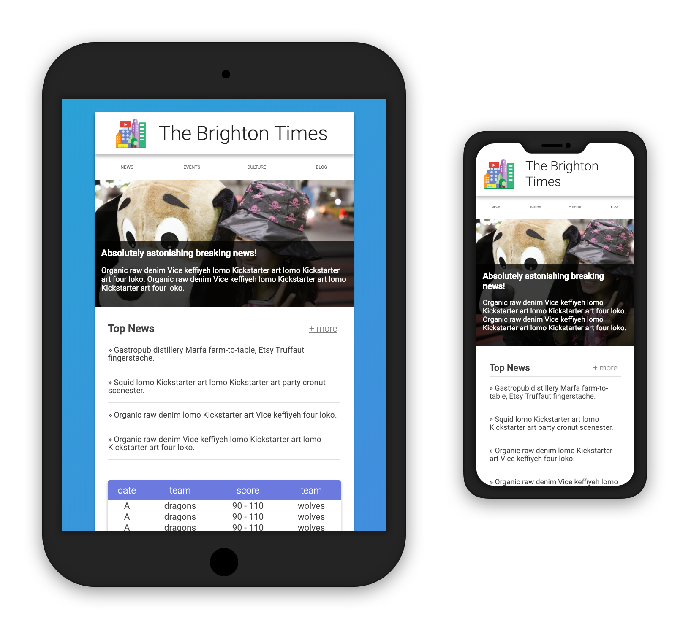

   
  
  <h1>Responsive Website!</h1>
  <strong>Built with just HTML and CSS (SCSS)</strong>

 
 

  
  
  

## About❓️
this project was created __from scratch__ while atttempting to replicate and swag-out Udacity's _Responsive Web Design_'s Lesson 2's website.

## Setup
* compile the scss with `sass styles/styles.scss styles/main.css `
* open `index.html` in your favorite browser
